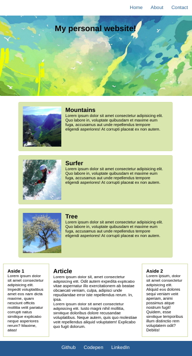
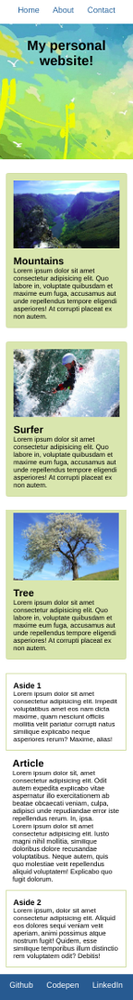

# UIB_Framework_SCSS_Exercise-1

This exercise focuses mainly importing files, variables, and @mixin topics.

Create a mockup website as seen in [this reference](https://hsnakk.github.io/UIB_Framework_SCSS_Exercise-1/)

## Instructions:

- Use SCSS to create the mockup.
- Make use of nesting, variables, @import, and @mixin where possible.
- Make sure to design for mobile first!
- With Bootstrap customization change the breakpoints to :
  - 768px - tablet
  - 1024px - desktop
- Colors for styling:
  - Card background color: #e0ddb2
  - Card and aside borders: #dad6ab
  - Color used for nav and footer: #016690
- Use the images in the images folder for the header and cards.

## Desktop design

## Tablet design

### Mobile design

